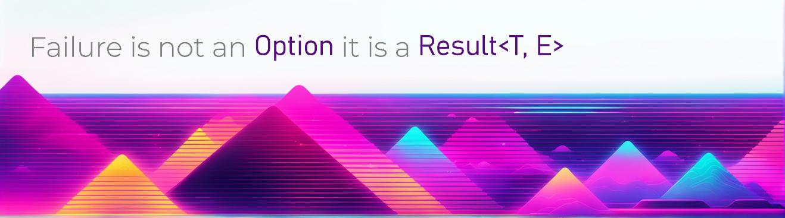

<!--  -->
### 👋 Hi, there
I am [Dior](https://github.com/diorwave), 
a fullstack engineer building across web, mobile, blockchain, AI, and decentralized networks.

####  👑 My old projects
 
 - <a href="https://github.com/diorwave/shinytouch">**diorwave/shinytouch**</a> - use webcam to make any surface touch-screen.
 - <a href="https://github.com/diorwave/cg2015">**diorwave/cg2015**</a> - c++/openGL demos for computer-graphics learning.
 - <a href="https://github.com/diorwave/ASKSpeak">**diorwave/ASKSpeak**</a> - translate ASL gestures to spoken words real-time.

####  ❤️ My Favorite Projects
 - <a href="https://github.com/diorwave/solana-program-library">**diorwave/solana-program-library**</a> - core on-chain programs for Solana blockchain.
 - <a href="https://github.com/diorwave/plutus-pioneer-program">**diorwave/plutus-pioneer-program**</a> - course materials for Cardano smart-contract dev.
 - <a href="https://github.com/diorwave/EduGPT">**diorwave/EduGPT**</a> - AI-powered tutor / teaching assistant using LLM + langchain.
 - <a href="https://github.com/diorwave/ogmios">**diorwave/ogmios**</a> - WebSocket JSON/RPC bridge for Cardano blockchain.
 - <a href="https://github.com/diorwave/langgraph">**diorwave/langgraph**</a> - Framework for building language agents as graph structures.
 - <a href="https://github.com/diorwave/firecrawl">**diorwave/firecrawl**</a> - Scrape and convert websites into clean LLM-ready datasets.
 - <a href="https://github.com/diorwave/Stockagent">**diorwave/Stockagent**</a> - project around stock-market agent/automation

#### 🧩 Full-Stack Projects
 - <a href="https://github.com/diorwave/tulos_updated">**diorwave/tulos_updated**</a>
 - <a href="https://github.com/diorwave/Stripe-Integration">**diorwave/Stripe-Integration**</a>
 - <a href="https://github.com/diorwave/The-Averion-Labs-Front-End">**diorwave/The-Averion-Labs-Front-End**</a>
 - <a href="https://github.com/diorwave/ecommerce-website">**diorwave/ecommerce-website**</a>
 - <a href="https://github.com/diorwave/HR-management">**diorwave/HR-management**</a>

#### ⛓️ Blockchain & Decentralized Projects
 - <a href="https://github.com/diorwave/Solidity-Contracts">**diorwave/Solidity-Contracts**</a>
 - <a href="https://github.com/diorwave/Solana-Arbitrage-Bot">**diorwave/Solana-Arbitrage-Bot**</a>
 - <a href="https://github.com/diorwave/pyledger">**diorwave/pyledger**</a>
 - <a href="https://github.com/diorwave/Plutus-prototye">**diorwave/Plutus-prototye**</a>
 - <a href="https://github.com/diorwave/bcc-ledger-space">**diorwave/bcc-ledger-space**</a>
 - <a href="https://github.com/diorwave/vots-smart-contracts">**diorwave/vots-smart-contracts**</a>
 - <a href="https://github.com/diorwave/solana-blockchain-development">**diorwave/solana-blockchain-development**</a>
 
#### 🤖 AI & Media Projects

  - <a href="https://github.com/diorwave/RunVSAgent">**diorwave/RunVSAgent**</a>
  - <a href="https://github.com/diorwave/Cyber-Security-LLM-Agents">**diorwave/Cyber-Security-LLM-Agents**</a>
  - <a href="https://github.com/diorwave/AI-Travel-Agent">**diorwave/AI-Travel-Agent**</a>
  - <a href="https://github.com/diorwave/Patentpath">**diorwave/Patentpath**</a>

<!-- 📱 Mobile Projects
  - <a href="https://github.com/diorwave/RunVSAgent">**diorwave/RunVSAgent**</a>
 -->

#### ⚙️ Other Projects
  - <a href="https://github.com/diorwave/discord-bot">**diorwave/discord-bot**</a>
  - <a href="https://github.com/diorwave/Solana-Trading-Bot">**diorwave/Solana-Trading-Bot**</a>
---
#### 📚 Books I'm reading
- **[[The Art of Doing Science and Engineering] - 2020 Edition: Learning to Learn - 2020, Paperback Edition](https://www.goodreads.com/book/show/155968362-the-art-of-doing-science-and-engineering---2020-edition)** by _Karios Mainec_
- **[Introduction to Zig: a project-based book](https://www.goodreads.com/book/show/220362789-introduction-to-zig)** by _Pedro Duarte Faria_
- **[Software Transparency: Supply Chain Security in an Era of a Software-Driven Society](https://www.goodreads.com/book/show/78919033-software-transparency)** by _Chris Hughes_
- **[Studio 21: Vokabeltaschenbuch B1](https://www.goodreads.com/book/show/51094341-studio-21)** by _CORNELSEN VERLAG GMBH 6 CO._

Thank you so much for watching everyone! 🙏
